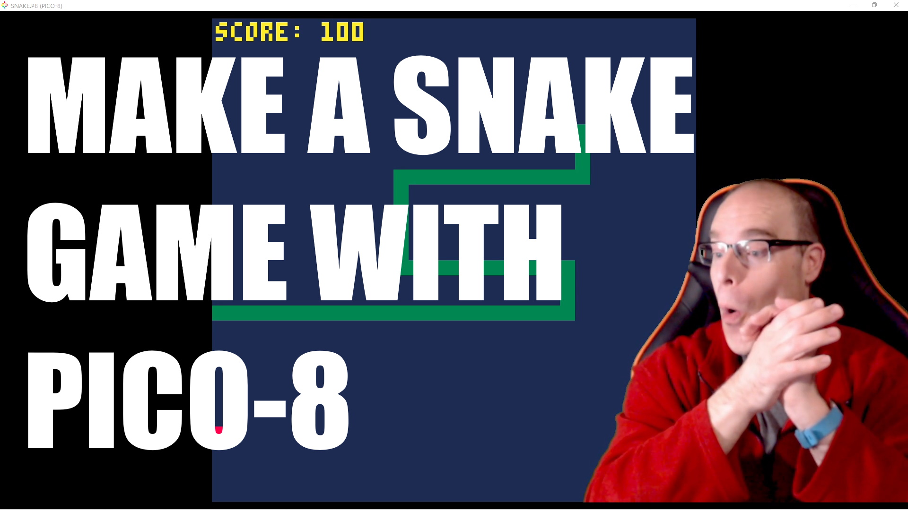

# snake-pico8
Snake for pico8!

## how to develop

- Have a fun attitude! :)
- Open your Pico-8 editor
- Create a new file `save snake`
- Enter the editor with `ESC`
- Cut & Paste the LUA code into your game
- Experiment and enjoy!
- Like my video and subscribe for more gamedev

